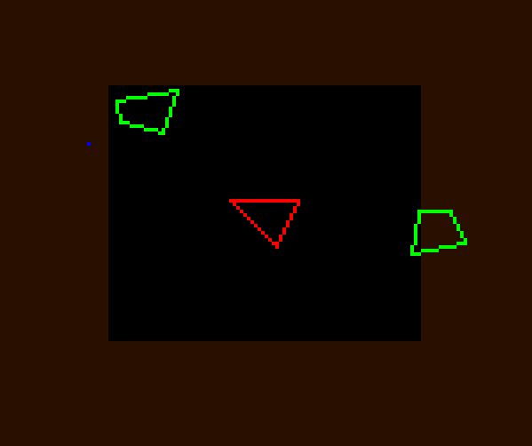

# Overview

Current issues:
 * No audio
 * No text rendering
 * Messy code with magic numbers

# Build Instructions
## Prerequisites
  - Rust (install via [rustup](https://www.rust-lang.org/tools/install))

## Instructions
 * Clone the repository and `cd` into the `asteroids_rust` directory.
 * Run;
   - `cargo run --release` for an optimized 'release' version.
   - `cargo run` for an unoptimized version with debug information.